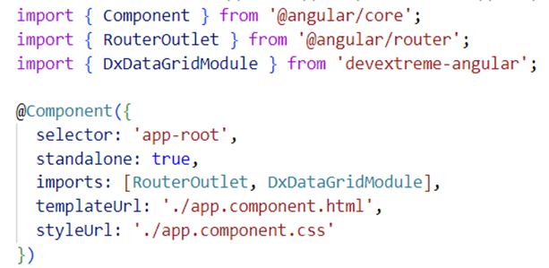
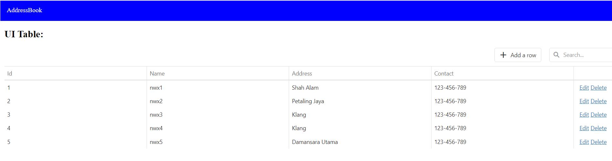

# Addressbook
Demo for Angular using DataGrid (DevExtreme)

Steps to Create the Project
1) Create a repository called addressbook in GitHub then clone using the command git clone to the project's location.

2) Then navigate to the cloned directory and open a terminal and run the command: ng new addressbook to create the Angular project.

3) To add devextreme to existing angular project run this command: npm install devextreme@23.2 devextreme-angular@23.2 –save –save-exact

4) Import the datagrid module to angular and paste the datagrid code as below:

*Figure 1 Import Module*

 

*Figure 2 DataGrid Module*

 

5) Run ng serve command to launch the application and type localhost:4200 on browser.

*Figure 3 AddressBook UI*

 

**CRUD Operations**

1) Adding:

2) Editing:

3) Deleting:

4) Global Search: